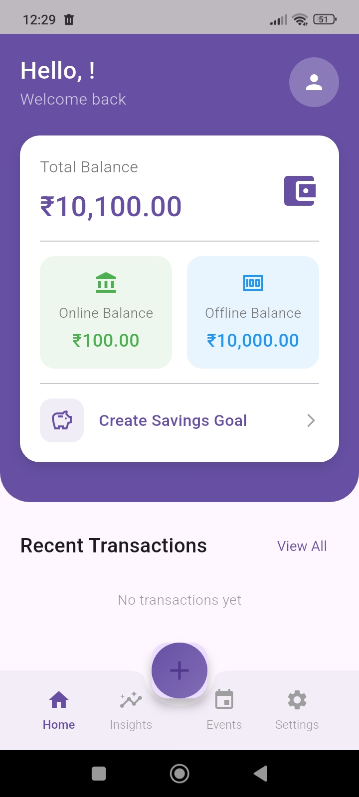
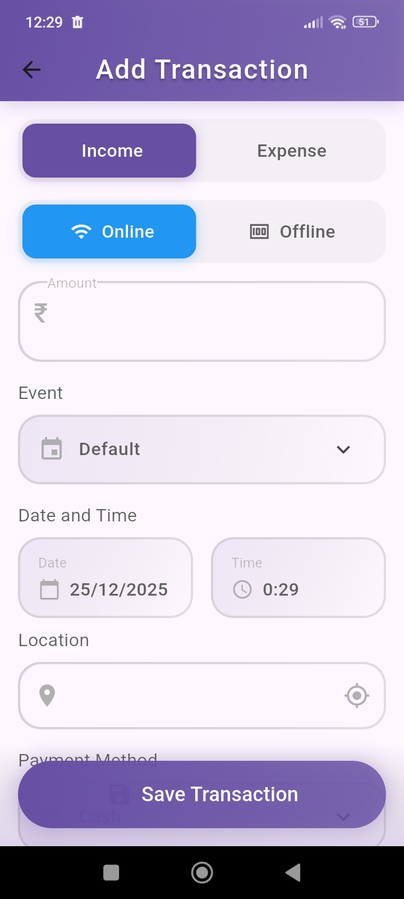
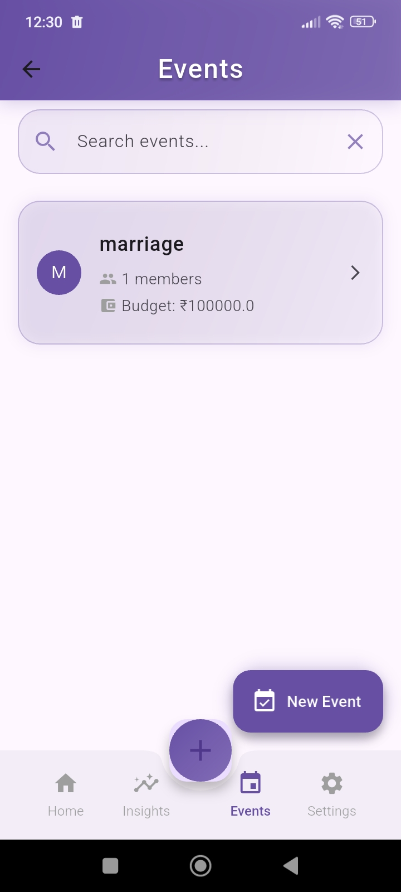
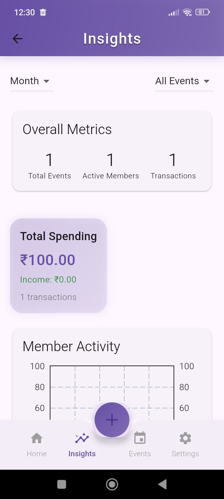

# PaySync – Expense Tracker 💳📊

PaySync is a smart expense tracking application designed to manage personal and event-based expenses efficiently.  
It supports real-time collaboration, budgeting, analytics, and seamless online–offline data synchronization.

The project is built with a **microservice-based backend using Spring Boot**, a **Flutter mobile application**, and **Firebase** for authentication and data storage.

---

## 🚀 Key Features

- 🔐 Secure user authentication using Firebase Authentication  
- ☁️ Online–offline data sync with Firestore and secure cloud backup  
- 📂 Event-based expense categorization and budgeting  
- 💱 Multi-currency expense tracking  
- 🧾 Detailed transaction records:
  - Payment mode
  - Notes
  - Images
  - Location  
- 👥 Real-time collaboration for shared event budgets  
- 📈 Insights & analytics dashboards:
  - Event-wise expense analysis
  - Overall spending patterns  

---

## 🛠️ Tech Stack

### Backend
- Java  
- Spring Boot (Microservices Architecture)  
- REST APIs  

### Mobile Application
- Flutter  

### Database & Authentication
- Firebase Authentication  
- Firebase Firestore  

### Tools
- Git & GitHub  
- Postman  

---

## 📦 APK Download

📱 **APK file has been added to the repository**

You can directly download and install the application using the APK available in the **root folder** of this repository.

> ⚠️ Enable *Install from Unknown Sources* on your Android device before installing.

---

## 🖼️ App Preview (Screenshots)

We have committed **4 preview images** in the **root folder** of the repository for reference.

> 📌 Note: Image file names will be updated later.  
> For now, all images are referenced from the root directory.

### 🔹 Preview Image 1


### 🔹 Preview Image 2


### 🔹 Preview Image 3


### 🔹 Preview Image 4


---

## 🏗️ Architecture Overview

- Microservice-based backend using Spring Boot  
- RESTful APIs for communication between Flutter app and backend  
- Firebase Authentication for secure login  
- Firestore for real-time database and offline persistence  

---

## ⚙️ Backend Setup (Optional – For Developers)

```bash
git clone https://github.com/your-username/paysync.git
cd paysync
